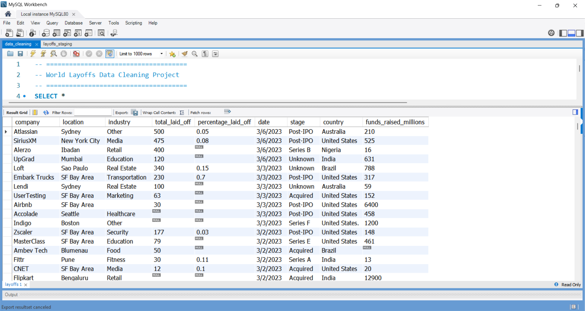
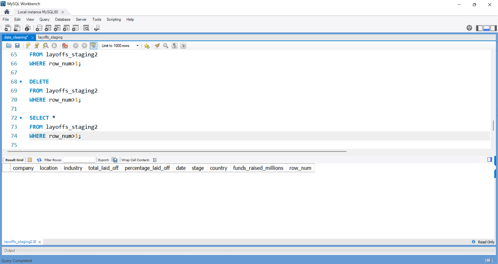
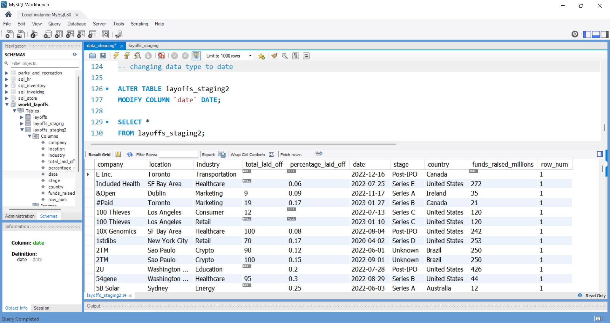
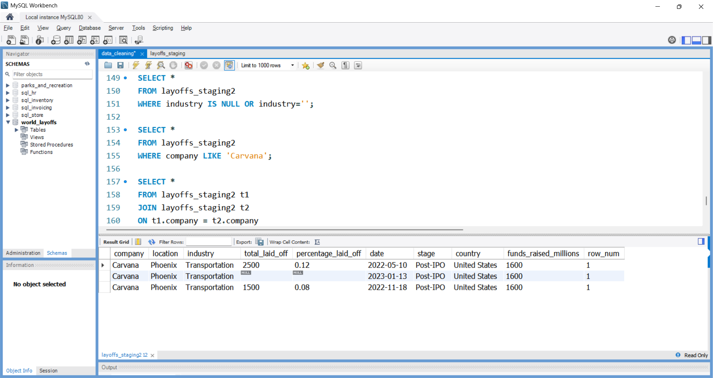
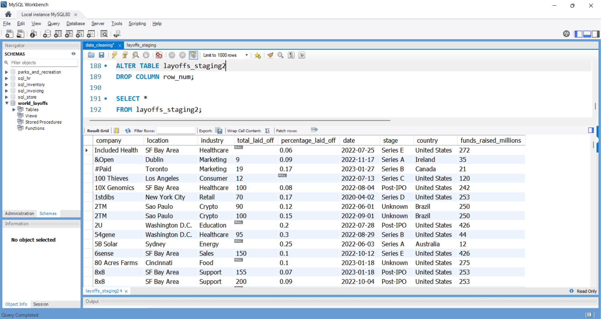

# SQL Data Cleaning Project - World Layoffs Dataset

## Overview

This project focuses on cleaning and preparing a real-world layoffs dataset using MySQL. The objective was to transform raw data into a clean and analysis-ready dataset by identifying duplicates, standardizing values, handling missing data, and removing unnecessary records.

## Dataset

The dataset contains information related to layoffs across different companies and industries, including:

* Company
* Location
* Industry
* Total Laid Off
* Percentage Laid Off
* Date
* Funding Stage
* Country
* Funds Raised

## Data Cleaning Steps

### 1. Removed Duplicates

* Created staging tables to preserve raw data.
* Used `ROW_NUMBER()` to identify duplicate records.
* Removed duplicate entries from the dataset.

### 2. Standardized Data

* Standardized company names.
* Standardized industry values.
* Standardized country values.
* Converted date values from text format to MySQL DATE format.

### 3. Handled Missing Values

* Converted blank values to NULL values.
* Populated missing industry values using available company information.
* Reviewed records with incomplete information.

### 4. Removed Unnecessary Records

* Removed rows that contained insufficient information for meaningful analysis.
* Finalized a clean dataset suitable for exploratory data analysis.

## SQL Concepts Used

* Window Functions
* ROW_NUMBER()
* Common Table Expressions (CTEs)
* UPDATE Statements
* DELETE Statements
* JOIN Operations
* Data Type Conversion
* NULL Handling
* Data Standardization

## Project Structure

dataset/ - Original dataset

sql_scripts/ - SQL data cleaning script

screenshots/ - Project screenshots

README.md - Project documentation

## Tools Used

* MySQL
* Git
* GitHub

## Outcome

Successfully transformed a raw layoffs dataset into a clean and analysis-ready dataset using SQL data cleaning techniques.
## Project Screenshots

### Raw Dataset

### Dataset After Duplicate Removal

### Dataset After Standardization

### Dataset After Null Handling

### Final Clean Dataset

